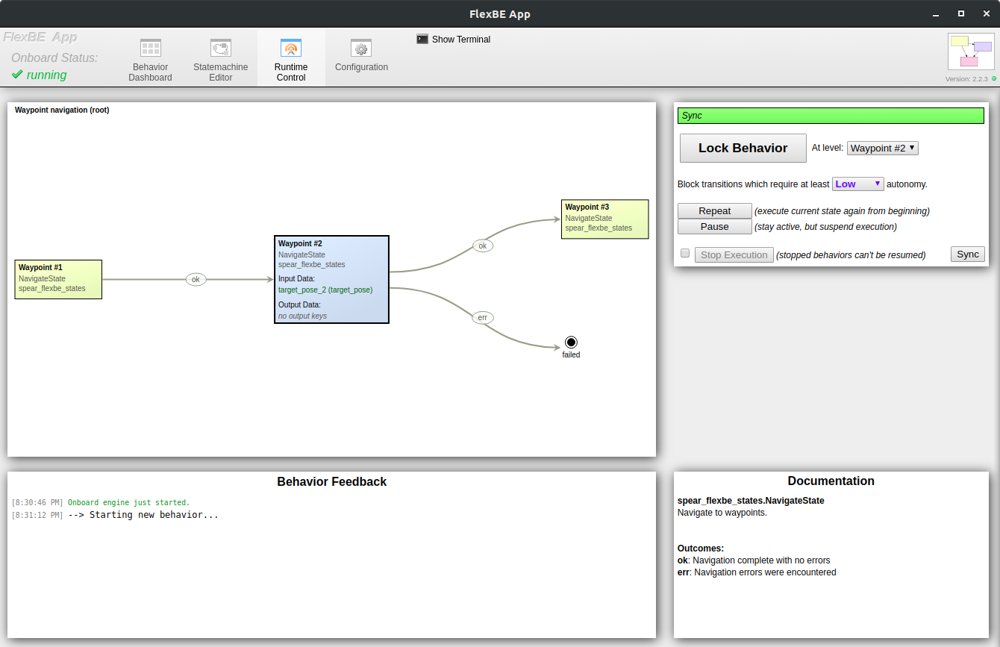

## Communication with the base station

As noted elsewhere, the code is split into several ROS packages.
Things in the `spear_rover` package are meant to be run on the rover.
Things in the `spear_station` package are meant to be run at a base station from which we control the rover.
The two communicate using [nimbro_topic_transport](https://github.com/AIS-Bonn/nimbro_network/tree/master/nimbro_topic_transport), which sends messages from a configured subset of topics between devices.
We can also SSH into the rover from the base station and run scripts on it directly (as we did in CIRC 2019), but this has some issues, such as that [rviz](https://wiki.ros.org/rviz/UserGuide) doesn't support X forwarding over SSH.

## Base station GUIs

### FlexBE

[FlexBE](https://wiki.ros.org/flexbe) provides the infrastructure for the state machine that runs during autonomous control.
Because the network connection between the rover and the base station is often poor, state machine logic must run on the rover itself.
FlexBE provides a graphical interface to define state machines for autonomous navigation and manages their synchronization and control between the rover and station.
The individual states are defined in the [spear_flexbe_states](https://github.com/UofA-SPEAR/software/tree/master/spear_behaviors/spear_flexbe_states) package.

Some additional notes about how FlexBE works

- The code is split into the *onboard* part which runs on the rover and the *app* part which runs at the base station
- If the source code for a state is changed, FlexBE does not recognize the change until `behavior_onboard.launch` is re-started. Stopping and re-starting the behavior from the app is not sufficient.
- Each FlexBE state in a behavior runs in the same process and likely in the same thread (nested behaviors are the same). Again, this is tied to the lifetime of the onboard part and does not change if the behavior is stopped and re-started.
- It appears that FlexBE onboard just imports the files containing the states normally, and doesn't do any sort of black magic to re-import them for nested behaviors or anything. One consequence of this is that one can define a global variable in a file somewhere and just import it from multiple places to easily share information between states in a way which persists across nested behaviors, behavior stop/re-start, etc.

`spear_station` contains a launch file which can be used to run the FlexBE app (`spear_station/flexbe.launch`).

### spearMCT

An OpenMCT plugin to display rover diagnostics such as battery or GPS position.
Currently a work in progress.

### Rover map view

This is a [React](https://reactjs.org/) app which displays the rover and predefined waypoints on a Google Map.
It was made in about three hours during CIRC 2019, is pretty rough around the edges, and will be deprecated once the diagnostics GUI is finished.
