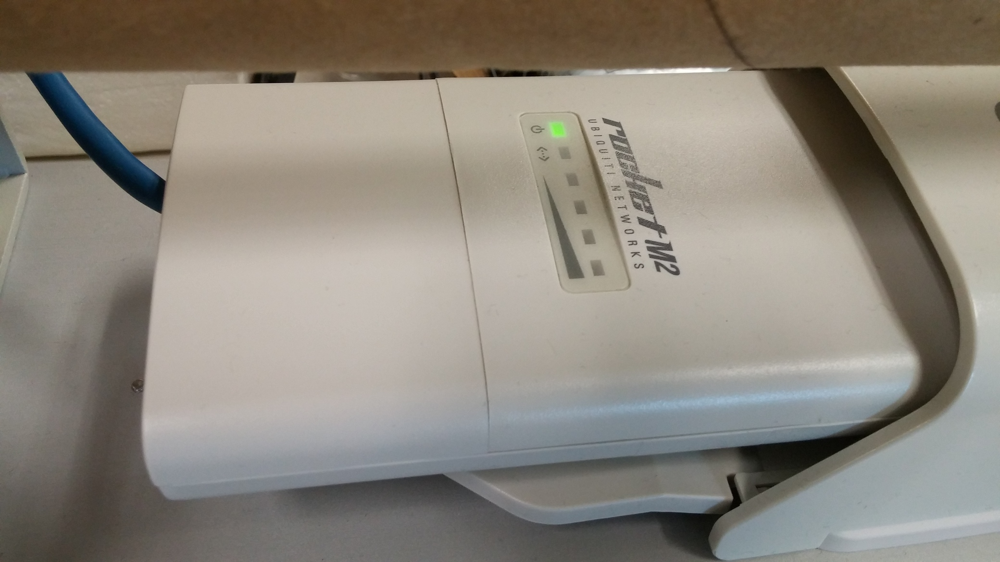
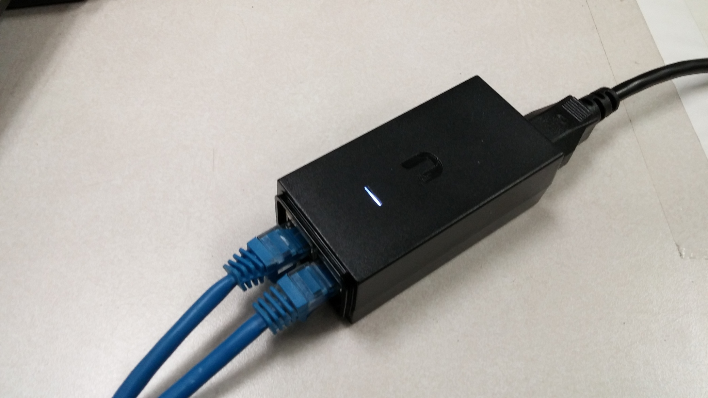
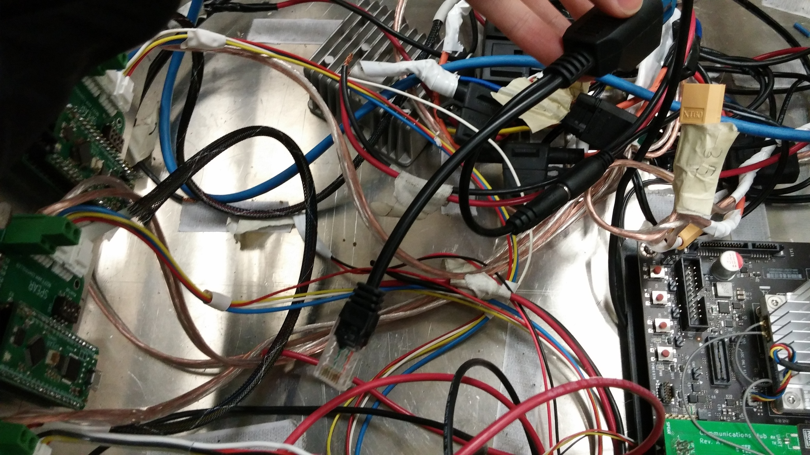

## Wiring

| Router (showing LEDs) | PoE Injector (base station) | PoE Injector (rover) |
|:---------------------:|:---------------------------:|:--------------------:|
|  |  |  |

The simplest way to connect a laptop to the rover is to directly connect each to an Ethernet cable.
However, it is generally more convenient to connect to the rover wirelessly.
We do this using two routers, one on the rover itself and one at the base station.
So our connection looks like laptop <-> station router <-> rover router <-> rover.

In detail, you will need to:
- **At the base station**: Plug in the PoE injector to a wall socket.
  Connect the base station router Ethernet cable to the port labeled `POE` on the PoE injector.
  Connect an Ethernet cable between the laptop and the port labeled `LAN` on the PoE injector.
- **At the rover**: Make sure the 3S battery is connected so the tx2 and router have power. Connect the tx2 to its power cable and turn it on (nominally you do this by pressing button nearest the green board once, but in practice you will probably have to mash buttons a bit before it turns on). Connect the Ethernet cable from the on-rover PoE injector to the tx2 (the router should already be connected).

## Router and base station configuration

The routers are configured as follows:
1. **Base station router**
  - device name: SPEAR Station
  - network mode: bridge
  - wireless mode: access point
  - ssid: SPEAR
  - ip address: 192.168.1.20
  - username/password: see the appropriate file on google drive
2. **Rover router**
  - device name: SPEAR Rover
  - network mode: bridge
  - wireless mode: station
  - ssid: SPEAR
  - ip address: 192.168.1.21
  - username/password: see the appropriate file on google drive
3. **Laptop**: the laptop is connected to the base station router via ethernet. In Ubuntu 18.04, make a new wired network configuration (under "Network" in settings) with IPv4 method `Manual`, ip address `192.168.1.<something>`, and netmask `255.255.255.0`. Change `<something>` to some number to customize your IP address to whatever you want.
4. **Rover**: the rover connection functions almost identically to the base station connection. The tx2 right now contains a premade configuration (called `SPEAR Station` or something similar) with ip address `192.168.1.61`.

> Note -- Currently connecting to the rover is only tested using the Docker configuration (with the network setup done natively in Linux). You may be able to get this working in a VM but it would require configuring the wired network connection in Windows and somehow giving the VM access to it.

We plan to eventually route all communication between the rover and the base station to nimbro_topic_transport, which directly sends ros topics over a network (ros can also do this automatically but nimbro_topic_transport gives more control over the process). Currently however we just run ros nodes on both the base station (in docker) and the rover (over ssh) and use ROS_MASTER_URI to tell ros where to send the topics. To set this up,

## Setting up and running a drive test

What follows is a guide to running the necessary code on the rover to perform drive tests.
This illustrates the general ideas behind connecting to the rover and running ROS nodes on it.

First, set up the physical and network configurations as described above.
There is no need to redo the network configuration setup for the tx2 and the routers, so you can skip those sections.

To verify this has been done correctly, you can
  - check the LEDs on the routers, which indicate the strength of the connection between the two
  - verify your laptop's connection to the base station router, using `ping 192.168.1.20`
  - verify your laptop's connection to the rover router, using `ping 192.168.1.21`
  - verify your laptop's connection to the tx2, using `ping 192.168.1.61`

Now ssh into the tx2 using `ssh -X nvidia@192.168.1.61` (the password is `nvidia`), and run `tmux` so we can run multiple things at once. Start a ROS master by running `roscore`.

Every time the tx2 reboots you will need to set up CAN.
To do this, run the setup script with

    make setup-can

Now run everything needed for drive using

    roslaunch spear_rover drive.launch simulation:=false station:=<your-station-ip>

A quick way to test the wheels at this point is to run *rqt_robot_steering* on the rover and move the sliders around.

> If the wheels don't move, and in the absence of an obvious error in `drive.launch`, there is probably a firmware issue in the wheel drivers (e.g. they are not configured properly).

However, it's better to control the rover directly from the base station.
To get started, plug the DualShock 3 controller into your laptop.
If all four red lights on the controller are flashing, it is not connected.
Press the central button to connect (once it is connected, only a single red light will be on).
To verify it is connected, run `ls /dev/input/js*` to list all connected joysticks.

The base station code runs locally on your laptop, not on the rover.
Start up a docker container by running `docker-compose run spear` from the `software` directory.

> To verify the joystick is visible from within the container, run `ls /dev/input/js*` in the container.

Run `tmux` to start up tmux in the container, since it is useful for debugging.
Now run `roslaunch spear_station station.launch rover:=192.168.1.61`.
Various GUIs will appear to control the arm and wheels.
You should also now be able to drive the rover around by holding down the left trigger and moving the left joystick.

> If at this point the wheels don't turn, but they *do* turn when using the steering GUI, something has gone wrong either in the station code or in the connection to the rover.
> Make sure to verify the previous sections if you have not done so already.
> For additional debugging, you might
>  - run `rostopic echo /joy` to see if the joystick input is being received at all
>  - run `rostopic echo /joy`, and make sure the left trigger and horizontal/vertical axes of the left joystick map to the correct buttons/axes (if not, you will have to change some parameters in `joystick.launch`)
>  - run `rostopic echo /drive_controller/cmd_vel` to verify that joystick inputs are being correctly translated to drive commands
>  - go back to the terminal that is ssh'd into the rover and run `rostopic echo /drive_controller/cmd_vel` in *that* terminal to verify that the drive commands are being correctly sent over the network

## Additional base station computers

To set up a base station with multiple computers, you can use ROS's built-in networking support.
Choose one computer to be the main station computer (the one where ros master runs).
For the purposes of this explanation, I will assume this computer has the IP address `192.168.1.13`.
Now set environment variables as follows:

- ***On the main computer***, `ROS_MASTER_URI` should be `http://192.168.1.13:11311` and `ROS_IP` should be `192.168.1.13`.
- ***On each other computer***, `ROS_MASTER_URI` should be `http://192.168.1.13:11311` and `ROS_IP` should be the IP address of that computer.
